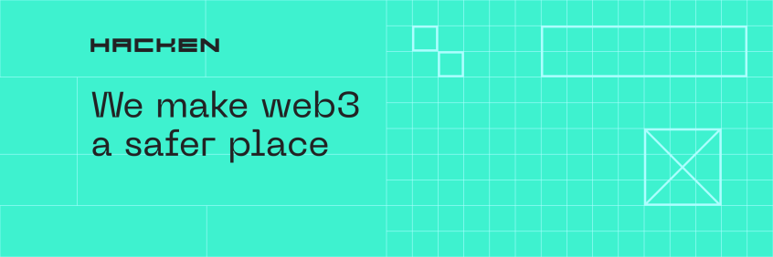

Hacken is a blockchain security auditor with a vision of transforming Web3 into a more ethical place. 
We protect Web3 projects and their communities with the suite of cybersecurity services such as Smart Contract Audit, L1 Blockchain Protocol Audit, dApp Audit, Pentest, Bug Bounty Program running on HackenProof, #1 bug bounty platform.

- 100+ protected clients
- 60+ top-class engineers
- 1200+ audits in 5 years

# :zap: Technologies

    

# Contact Us

# Careers 

Let's team up and make the Web3 world safer together! Check out our opportunities on [Hacken Careers](https://hacken.peopleforce.io/careers)